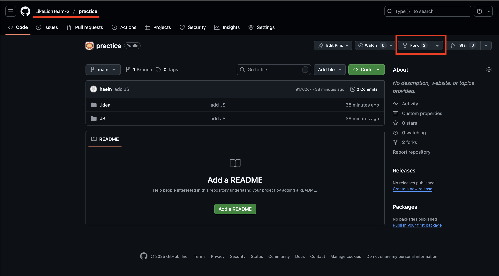
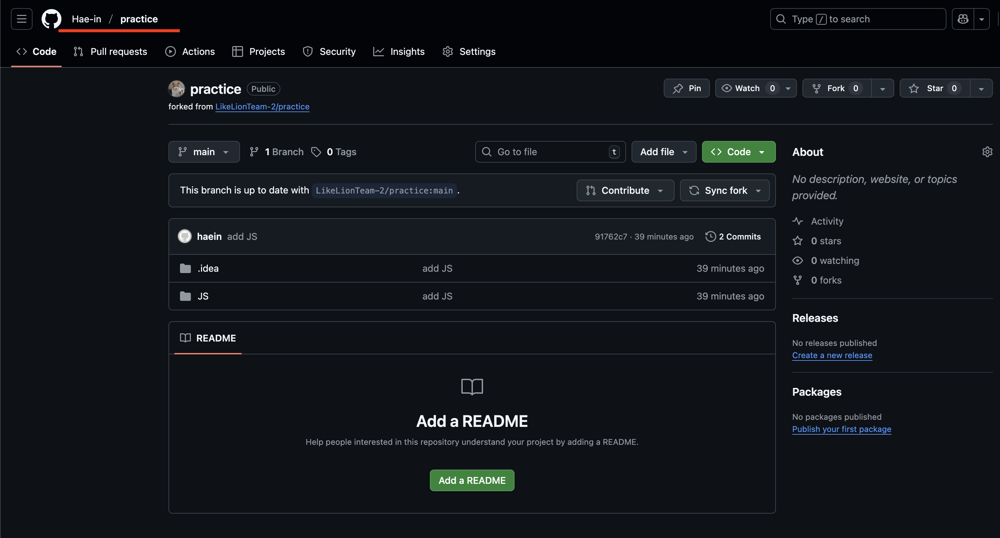
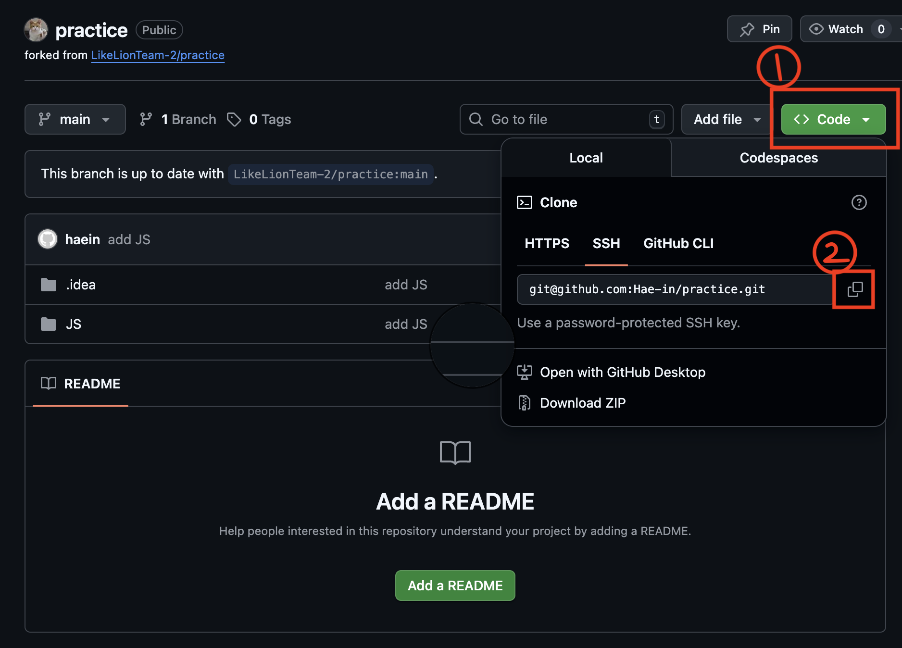
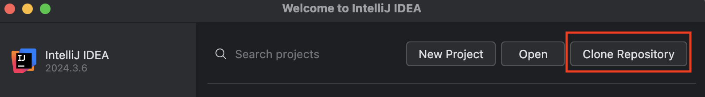
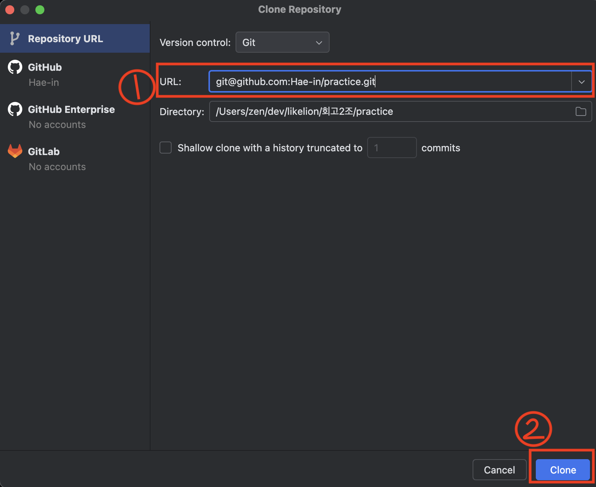

### 1. 협업 레포지토리 `fork`
- [협업용 레포지토리](https://github.com/LikeLionTeam-2/practice)를 `fork`합니다.
  
- 그러면 자신의 계정 밑에 같은 이름의 레포지토리가 생깁니다.
  

⭐️ **왼쪽 상단**에서 협업 레포지토리인지, 본인 레포지토리인지 확인할것!

---

### 2. `fork`한 레포지토리 `clone`
- `code`를 눌러 url을 복사합니다.
  
- IntelliJ에서 `Clone Repository`를 선택합니다.
  

- 복사한 url을 붙여넣고 `Clone`을 선택합니다.
  
---

### 3. 커밋 컨벤션
| 태그       | 설명                      |
|:---------|:------------------------|
| feat     | 새로운 기능 추가               |
| fix      | 버그 수정                   |
| refactor | 코드 리팩토링                 |
| comment  | 주석 추가(코드 변경 X) 혹은 오타 수정 |
| docs     | README와 같은 문서 수정        |
| merge    | merge                   |
| rename   | 파일, 폴더명 수정 혹은 이동        |